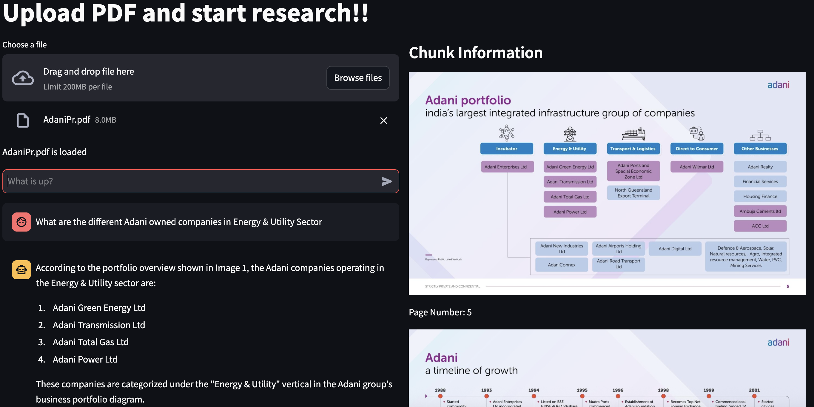

# Voyage Multi-modal Researchmate

- Clone repository

```
git clone https://github.com/vinodkrishnan23/mdb-genai-demos.git
```

- Install all python libraries - streamlit,pymongo etc.

```
cd mdb-genai-demos/researchmate
python3 -m pip install -r requirement.txt
```

- Modify/Create .secrets.toml file within .streamlit folder with below details

```
VOYAGEAI_KEY="Your Voyage AI API Key"
MONGODB_URI = "Your MongoDB connection string"
DB_NAME = "your database name"
COLLECTION_NAME = "your collection name"
service_name = "bedrock-runtime"
aws_access_key_id="Your AWS Access Key"
aws_secret_access_key="Your AWS Secret Access Key"
aws_session_token="Your AWS Session Token"
```

- Run the application

```
streamlit run researchmate.py
```

- Upload a PDF; wait until Voyage does the magic

- Ask your questions



